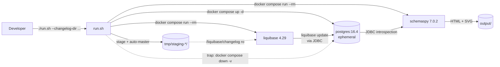
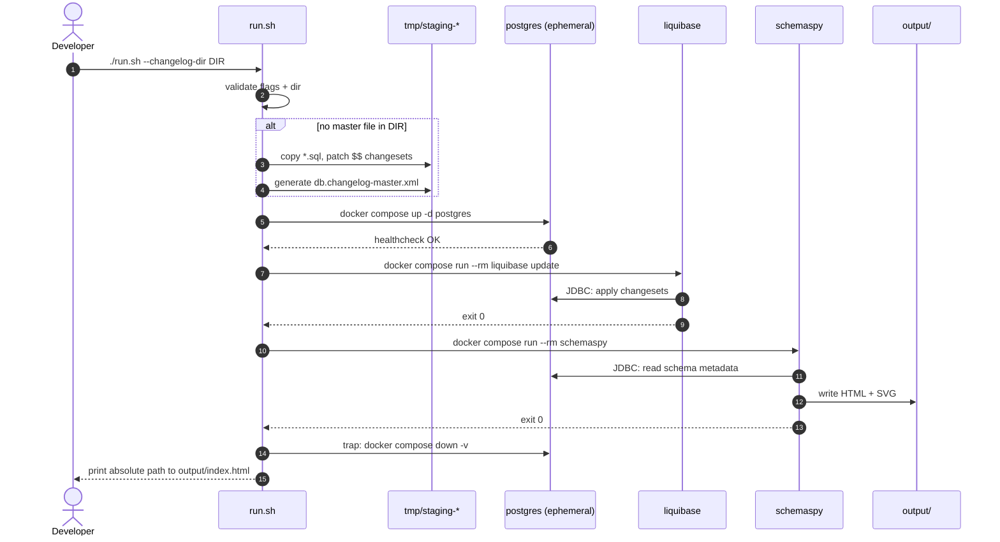

# Architecture

## Component view



## Components

### `run.sh` — the orchestrator

A bash script (the single entry point). Responsibilities:

- Parse CLI flags (`--changelog-dir`, `--master-file`, `--output`,
  `--schema`).
- **Staging**: if no master file exists in the input dir, build a
  deterministic copy under `tmp/staging-<ts>-<pid>/`:
  - Generate `db.changelog-master.xml` listing `*.sql` files in
    lexical order via `<include relativeToChangelogFile="true">`.
  - For any file whose body contains `$$`, append
    `splitStatements:false` to its `--changeset ...` line so Liquibase
    doesn't split PL/pgSQL bodies on `;`.
- Generate a unique compose project name (`liquigraph-$(date +%s)-$$`)
  so concurrent runs don't collide.
- `docker compose up -d postgres`, then run liquibase, then schemaspy.
- `trap` ensures `docker compose down -v` runs on EXIT, INT, TERM.
- Verify `output/index.html` exists; print its absolute path on success.

User source files are never modified. Only files under `tmp/staging-*/`
are written.

### Disposable PostgreSQL (`postgres:16.4`)

- Healthcheck: `pg_isready -U liquigraph -d liquigraph`.
- No published port, no named volume — network-internal and ephemeral.
- Credentials are dummy (`liquigraph`/`liquigraph`/`liquigraph`),
  scoped to the throwaway container.

### Liquibase (`liquibase/liquibase:4.29`)

- `depends_on: postgres` with `condition: service_healthy`.
- Mounts the (staged) changelog dir read-only at `/liquibase/changelog`.
- Runs `--search-path=/liquibase/changelog --changelog-file=<master>
  --url=jdbc:postgresql://postgres:5432/liquigraph update`.
- Exits non-zero on failure → run.sh aborts → trap tears down.

### SchemaSpy (`schemaspy/schemaspy:7.0.2`)

- `depends_on: postgres` (healthy).
- Mounts the user's `--output` dir at `/output`.
- Reads the populated schema via JDBC, emits HTML + SVG diagrams.
- Pinned to 7.0.2 because 6.x is amd64-only and Graphviz segfaulted
  under arm64 emulation; 7.0.2 ships native arm64.

## Run lifecycle



## Configuration surface

| Flag              | Default                       | Purpose                              |
|-------------------|-------------------------------|--------------------------------------|
| `--changelog-dir` | `./example/changelogs`        | Host path mounted into Liquibase.    |
| `--master-file`   | `db.changelog-master.xml`     | Master file path *within* that dir.  |
| `--output`        | `./output`                    | Where SchemaSpy writes HTML.         |
| `--schema`        | `public`                      | Postgres schema to document.         |

Everything else (DB name, user, password, port, image versions) is
internal to the ephemeral containers and pinned in `docker-compose.yml`.

## Failure modes

| Failure                          | Behavior                                              |
|----------------------------------|-------------------------------------------------------|
| `--changelog-dir` missing        | Pre-flight error, exit 2, no containers started.      |
| Master file missing & no `*.sql` | Pre-flight error, exit 2.                             |
| Postgres never becomes healthy   | Compose `condition: service_healthy` blocks; trap fires.|
| `liquibase update` fails         | Run aborts; Liquibase error shown; trap tears down.   |
| SchemaSpy fails                  | Run aborts; output may be partial; trap tears down.   |
| Ctrl-C / SIGTERM                 | `on_signal` cleans up, re-raises signal so caller sees a non-zero exit. |

## Security & isolation

- Postgres bound to the Docker network only (no host port published).
- The user's changelog directory is mounted **read-only**; only
  `tmp/staging-*/` is mutated, and even then only on a copy.
- No credentials are persisted; the throwaway DB password is a literal
  placeholder in `docker-compose.yml`.

## Repository layout

```
.
├── README.md
├── docker-compose.yml     # postgres + liquibase + schemaspy services
├── run.sh                 # orchestrator
├── example/
│   ├── changelogs/        # minimal author/book XML changelog
│   └── w12-changesets/    # real-world formatted-SQL changesets
├── specs/
│   └── system/            # this directory
├── tmp/                   # staging dirs + browser screenshots (gitignored)
└── output/                # generated HTML site (gitignored)
```
