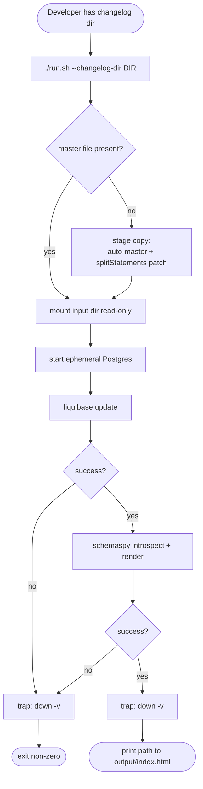

# Functional specification

## Primary user journey

A developer has a directory of Liquibase changelogs and wants a
browsable HTML schema site without installing Liquibase, a JVM, or
PostgreSQL locally.

## Inputs

| Input | Form |
|-------|------|
| Changelog directory | Any directory readable from the host. Contents may include `.xml`/`.yaml`/`.json` Liquibase changelogs and/or formatted-SQL files. |
| Master file | Optional. If absent and the directory contains `*.sql`, liquiGraph auto-generates one in staging. |
| Output directory | Any writable host directory; created if missing; existing contents are deleted at the start of a run. |
| Schema name | Postgres schema to document. Defaults to `public`. |

## Outputs

| Output | Form |
|--------|------|
| Static site | `output/index.html` plus per-table pages, FK relationship pages, constraint listings, orphan-table view, all under the user's `--output` dir. |
| ER diagrams | SVG files under `output/diagrams/` (summary, per-table, orphans). |
| Console | Three `==>` progress lines (postgres up, liquibase update, schemaspy) and the absolute path to `index.html` on success. |
| Exit code | `0` on success; `2` on input validation; non-zero on container failure or signal. |

## Supported changelog forms

| Form | How liquiGraph handles it |
|------|---------------------------|
| XML / YAML / JSON master + includes | Used as-is (no staging needed) when the master file is present. |
| Formatted SQL only (no master) | Staging dir is built: `*.sql` listed lexically in an auto-generated `db.changelog-master.xml`; PL/pgSQL bodies (`$$`) get `splitStatements:false`. |
| Mixed (master + extra SQL) | Master path is honored; no auto-generation. |

## Determinism guarantees

- Pinned image tags: `postgres:16.4`, `liquibase/liquibase:4.29`,
  `schemaspy/schemaspy:7.0.2`.
- Staging include order: lexical sort by filename.
- Staging mutations are limited to a single `sed` rule on
  `--changeset` lines of files containing `$$`.
- Source files are read-only inputs; only `tmp/staging-*/` is written.
- No AI, no network calls beyond Docker pulls and JDBC.

## Invariants the system maintains

1. After any run (success, failure, signal), no containers from this
   run remain (`docker ps` is clean).
2. The user's changelog directory is byte-identical before and after
   the run.
3. On success, `output/index.html` exists and the previous run's
   contents have been removed.
4. Each run uses a unique compose project name, so parallel runs do
   not collide.

## Permissions / authorization

- None. liquiGraph is a local CLI tool; the only authority needed is
  Docker access and write permission on the output directory.
